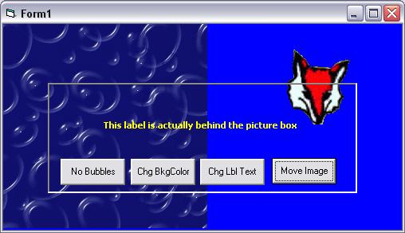



## FYI: Transparent PictureBox?

### Description

Not really transparent, but a "fun" project using a transparent usercontrol (UC) that acts as a proxy for a picturebox. The UC prevents need for subclassing. It gets paint events from the Form and the UC then updates the picturebox. In short, a niffty little hack to make a picturebox appear transparent. Think some of you might like this &amp; it is quite simple too. Feel free to expand on the idea.
 
### More Info
 

             |
---                |---
**Submitted On**   |2006-10-09 17:09:14
**By**             |[LaVolpe](https://github.com/Planet-Source-Code/PSCIndex/blob/master/ByAuthor/lavolpe.md)
**Level**          |Intermediate
**User Rating**    |5.0 (40 globes from 8 users)
**Compatibility**  |VB 6\.0
**Category**       |[Custom Controls/ Forms/  Menus](https://github.com/Planet-Source-Code/PSCIndex/blob/master/ByCategory/custom-controls-forms-menus__1-4.md)
**World**          |[Visual Basic](https://github.com/Planet-Source-Code/PSCIndex/blob/master/ByWorld/visual-basic.md)
**Archive File**   |[FYI\_\_Trans2024101092006\.zip](https://github.com/Planet-Source-Code/lavolpe-fyi-transparent-picturebox__1-66744/archive/master.zip)

